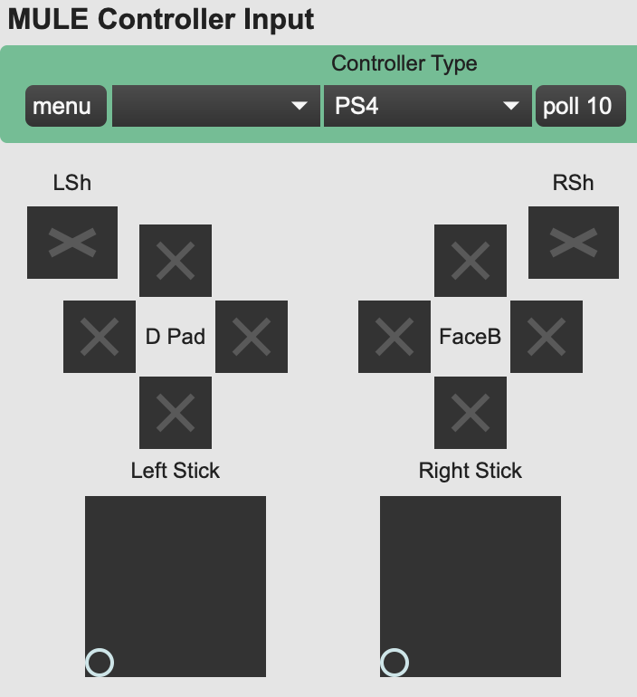

# Controller Mapping

The Max patch in this folder has been created to automatically map and sort incoming data from various video game controllers. Still needs some testing and improvement.

It is intended to be used inside of a bpatcher. To create the bpatcher in your Max patch:
1. Make sure that the MULE21 folder has been added to your Max File Preferences under the Options menu
2. Open the patch that needs controller input and unlock (put in edit mode).
3. Create a blank new object (n key) and enter "bpatcher controllerMappingv2"
4. Expand the size of the resulting window so that you can see all of the controls.

There are several outputs at the bottom of the bpatcher. Each will output values in the range 0-255. If you hover your cursor over the output, it will display a popup that tells you what the corresponding control is.