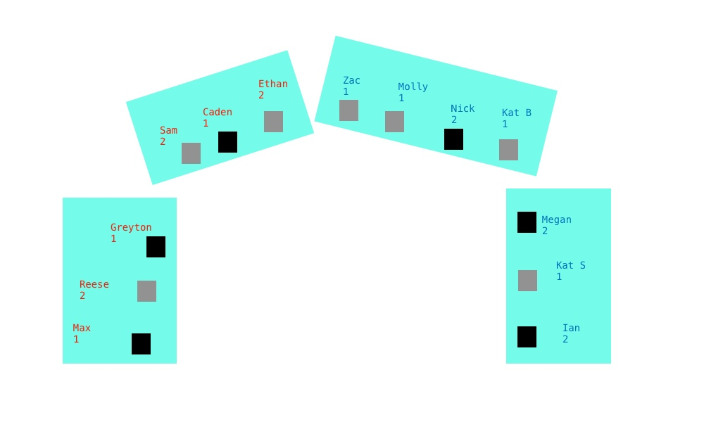

# MULE-F21

Repository for Miami University Laptop Ensemble files.  
  
## Repertoire List

### Final Program for Nov 19 Concert
- [Singaporean Crosswalk](SingaporeanCrosswalk) - Joo-Won Park
- [Clapping Music (Tekken)](ClappingMusic)
- [Unmute](Unmute) - Flannery Cunningham (half of ensemble)
- [Sound[ESC]](SoundESC) (half of ensemble)
- [Gibber/Gabber improvisation](Gibber) - use Gabber room MULE1119 for performance

---

### Software List:
All MULE members are expected to install these applications on their laptops.
- [Max](https://cycling74.com/downloads)
- [RetroArch](https://www.retroarch.com/)
- [SuperCollider](https://supercollider.github.io/)

### General Resources:
- [Controller Mapping](Other/ControllerMapping)
- [Gibber Site](https://gibber.cc/alpha/playground/)

All good.
